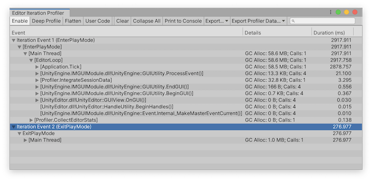

# Using the Editor Iteration Profiler
Once you’ve installed the Editor Iteration Profiler, navigate to __Window &gt; Analysis &gt; Editor Iteration Profiler &gt; Show Window__. This opens the EIP in its own window. 

  
*The Editor Iteration profiler window*

## Editor Iteration Profiler controls
The controls for the EIP are in the toolbar at the top of the window. You can use these controls to navigate through the data and export it.

|**Control**|**Function**|
|---|---|
|**Enable**|Enables the Editor Iteration Profiler and starts collecting data. When you select this button, the EIP also enables the Profiler and sets it to run with the __Editor__ as its profiling target.| 
|**Deep Profile**|Collects all information on managed calls. For more information on deep profiling, see the documentation on the [Profiler window](https://docs.unity3d.com/Manual/ProfilerWindow.html#deep-profiling).|
|**Flatten**|Collapses events in the table that contain multiple parent items with one child. This is useful if you are investigating GUI code or have performed Deep Profiling.|
|**User Code**|Filters out Unity engine code and displays information related to your own code.|
|**Clear**|Removes all recorded events from the EIP.|
|**Collapse All**|Recursively collapses all events in the table.|
|**Print to Console**|Logs all data to the console in a plain text format.|
|**Export**|Export all of the data in the EIP. You can choose from HTML, JSON, CSV, Plaintext, or HTML Performance Report. For more information on this see the documentation on [Exporting data](exporting-data.md).|
|**Export Profiler Data**|Export the data in the EIP for the selected Profiler frame, or choose a range of Profiler frames to export the EIP data for. When you select **Multiple Frames**, the beginning and end limits are inclusive. For more information, see the documentation on [How to export data](exporting-data#how-to-export-data.md)|
