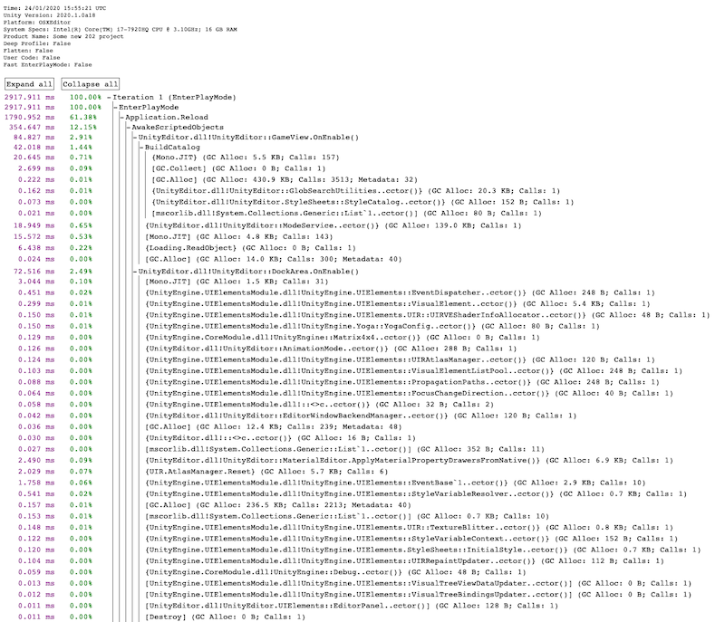
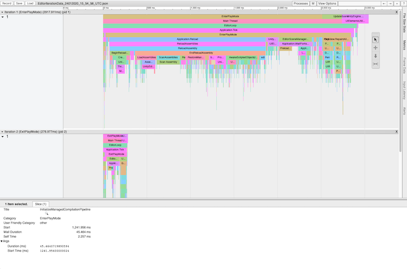

# Exporting Data

You can export the data that the Editor Iteration Profiler captures in several different file formats so that you can inspect the performance of your application in greater detail. The following file formats are available:

* [.html](exporting-data#html.md)
* [.json](exporting-data#json.md) (for [chrome tracing](http://www.chromium.org/developers/how-tos/trace-event-profiling-tool))
* [.csv](exporting-data#csv.md)
* [Plain text](exporting-data#plain-text.md)
* [HTML Performance Report](exporting-data#html-report.md)

## How to export data
To export all of the data that the EIP has captured, select __Export__ in the toolbar at the top of the EIP window, and then choose the format you want to export the data in. The EIP then displays a Save dialog box, where you can choose where to save the data to.

To export the data that the EIP has captured for a particular frame in the Profiler, select that frame in the Profiler window. Then in the EIP window’s toolbar, select __Export Profiler Data &gt; Export Selected Frame__ and choose the format you’d like to export the data to. The EIP then displays a Save dialog box, where you can choose where to save the data to.

You can also export the data the EIP has captured for a range of Profiler frames. To do this, select __Export Profiler Data &gt; Multiple Frames__ in the EIP window’s toolbar, and then choose the format you’d like to export the data to. The EIP then displays a dialog box that you can use to set the beginning and end range for the frames you want to export the data for.

  
*The frame range selector dialog box*

Select the __Export__ button and then the EIP displays a Save dialog box where you can choose where to save the data to.

## HTML export option
The __HTML__ export option exports the EIP data to a .html format that you can then open in a web browser and inspect further. It contains the same data in the EIP window, but also displays a percentage of how much time was spent on each event. 

  
*EIP data in HTML format*

> [!NOTE]
> Events in square brackets are leaf items without any children.

## JSON export option
The __JSON__ export option exports the EIP data to a .json format, which you can then use to visualize the data with the [Chrome Tracing](http://www.chromium.org/developers/how-tos/trace-event-profiling-tool) tool. To use Chrome Tracing, go to `chrome://tracing` in a Chromium-based web browser(Google Chrome, Microsoft Edge Chromium, Opera, etc.), and then import the .json file.

  
*EIP data in .json format imported into Chrome Tracing*

## CSV export option
The __CSV__ export option exports the EIP data to a .csv format which you can then use to import the data into other programs, such as Excel or a Python library. 

> [!NOTE] 
>This file contains a header in which environment information is stored (system specs, date etc.)

## Plaintext export option
The __Plaintext__ export option exports the EIP data into a plain text file format. This is the same data that you can display in the console if you select __Print to Console__ button in the EIP window’s toolbar. It also gives you the option to isolate the data and remove other information which is in the `Editor.log` file.

## HTML Performance Report export option
The __HTML Performance Report__ displays the EIP data in a similar way to the HTML export option, but additionally groups together information and also reduces the number of levels you need to click through to get to important information.

  
*HTML Performance Report view*

Items in curly brackets `{}` represent items that have children that the EIP hid because the parents were under the minimum set threshold, which is currently set to a hard-coded value of 1%.

The colored items represent ‘buckets’ of similar data, which the EIP groups in one place for convenience. The EIP does not add the total time of these to the original time, and it gives an estimate for that iteration.
